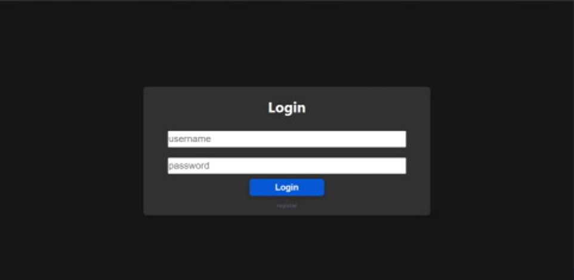

<div align="center">
<h1>Sporty Leaderboards</h1>
<hr>
<strong>
    An open source workout leaderboard for the private use.
</strong><br>
<a href="https://hub.docker.com/r/mathisburger/sporty-leaderboards">

</a>&nbsp;


</div>
---

<div align="center">


</div>

# Idea

---
I had the idea for this project, because I wanted to monitor my own workouts
and compare them with my friends workout.
I also wanted to learn new technologies like React and Rust.

# Installation

---
**NOTE: You need docker and docker-compose installed on your machine to run the app**

Now you need to setup your ``docker-compose.yml``. <br>
Create a file named ``docker-compose.yml`` and paste the content of the
<a href="https://github.com/MathisBurger/sporty-leaderboards/blob/master/docker-compose.yml">sample file</a>.<br>

Now you need to download and start the docker images:
```
docker-compose up
```

If ``backend_1`` logs outputs like ``PoolTimedOut`` the MySQL server failed to 
init and you have to do this manually.

To set up the MySQL server manually follow following instructions:

Stop the running containers by pressing ``STRG + C``.

Now you need to start the container in detached mode, because you need to 
access the MySQL server.
```
docker-compose up -d
```

You need the containerID of the MySQL container.
```
docker ps -a
```
Copy the containerID of the MySQL container.<br>
To access the container type:
```
docker exec -it <containerID> /bin/bash
```

Now you will be redirected to the bash terminal of the MySQL container.
Open MySQL terminal my typing:
```
mysql
```

Now you got redirected into the MySQL terminal.
First you need to reset create a new user, with access from every host:
```mysql
CREATE USER '<username>'@'%' IDENTIFIED BY '<password>';
```
Create the database:
```mysql
CREATE DATABASE 'sporty-leaderboards';
```
Grant all privileges on database to user (username is the name of the created user):
```mysql
GRANT ALL PRIVILEGES ON `sporty-leaderboards`.* TO '<username>'@'%';
```

Now you need to change your ``docker-compose.yml``.<br>
Change ``DATABASE_URL`` to ``mysql://<username>:<password>@db:3306/sporty-leaderboards``<br>
``<username>`` is the username of your user and ``<password>`` the password.

Now you need to restart your docker containers.
```
docker-compose restart -d
```

# User setup

---
Now you can try to open ``http://MASCHINE_IP:APPLICATION_PORT`` in your browser.<br>
It should look like this:
<div align="center">

</div>
Now you need to setup the default user. Process the registration on
the webpanel.<br>
After that go back into mysql bash and type:

```mysql
UPDATE `sporty-leaderboards`.`user_accounts` SET `status`='1' WHERE `username`='<username>';
```

Now your installation is completely installed.


